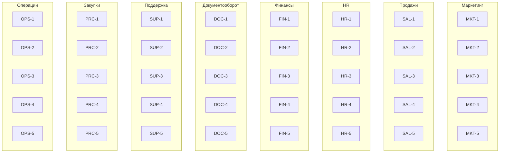

# Вертикали, сценарии и pipeline-цепочки

## 1. Перечень вертикалей

1. Маркетинг
2. Продажи
3. HR
4. Финансы
5. Документооборот
6. Поддержка клиентов
7. Закупки и снабжение
8. Операции и производство

## 2. Сценарии по вертикалям (5 сценариев на вертикаль)

### 2.1. Маркетинг

| ID | Сценарий | Краткое описание |
| --- | --- | --- |
| MKT-1 | Лид-магнит и сбор контактов | Публикация формы и сбор лидов в CRM. |
| MKT-2 | Автоматизация email-кампаний | Сегментация и рассылки по триггерам. |
| MKT-3 | Контент-план и публикации | Планирование, согласование и постинг. |
| MKT-4 | Аналитика рекламных кампаний | Сбор данных и анализ ROI. |
| MKT-5 | Управление мероприятиями | Регистрация, напоминания, пост-анализ. |

### 2.2. Продажи

| ID | Сценарий | Краткое описание |
| --- | --- | --- |
| SAL-1 | Обработка входящего лида | Квалификация и назначение менеджера. |
| SAL-2 | Подготовка КП | Генерация коммерческого предложения. |
| SAL-3 | Согласование скидки | Маршрут согласования условий сделки. |
| SAL-4 | Прогнозирование продаж | Сбор данных по воронке и прогноз. |
| SAL-5 | Оформление сделки | Подпись договора и запуск исполнения. |

### 2.3. HR

| ID | Сценарий | Краткое описание |
| --- | --- | --- |
| HR-1 | Подбор персонала | Публикация вакансии и найм. |
| HR-2 | Онбординг сотрудника | Доступы, обучение, первые задачи. |
| HR-3 | Оценка эффективности | Цели, сбор обратной связи, отчёт. |
| HR-4 | Отпуска и отсутствия | Согласование и отражение в календарях. |
| HR-5 | Обучение и развитие | Запись на курсы и трекинг прогресса. |

### 2.4. Финансы

| ID | Сценарий | Краткое описание |
| --- | --- | --- |
| FIN-1 | Обработка счетов от поставщиков | Верификация и оплата. |
| FIN-2 | Бюджетирование | Сбор заявок и утверждение бюджета. |
| FIN-3 | Финансовая отчётность | Сбор данных и формирование отчётов. |
| FIN-4 | Контроль ДДС | План-факт, алерты по отклонениям. |
| FIN-5 | Возмещение расходов | Заявка сотрудника и выплатa. |

### 2.5. Документооборот

| ID | Сценарий | Краткое описание |
| --- | --- | --- |
| DOC-1 | Регистрация входящих документов | Классификация и маршрутизация. |
| DOC-2 | Согласование договора | Маршрут согласования и фиксация правок. |
| DOC-3 | Архивация документов | Хранение и поиск. |
| DOC-4 | Подготовка шаблонов | Единые шаблоны и версия. |
| DOC-5 | Электронная подпись | Подписание и проверка статуса. |

### 2.6. Поддержка клиентов

| ID | Сценарий | Краткое описание |
| --- | --- | --- |
| SUP-1 | Регистрация обращений | Омниканальный сбор тикетов. |
| SUP-2 | Эскалация SLA | Контроль сроков и эскалации. |
| SUP-3 | База знаний | Создание и публикация статей. |
| SUP-4 | Возвраты и претензии | Проверка условий и запуск возврата. |
| SUP-5 | Аналитика качества | CSAT/NPS и отчёты. |

### 2.7. Закупки и снабжение

| ID | Сценарий | Краткое описание |
| --- | --- | --- |
| PRC-1 | Заявка на закупку | Создание и согласование запроса. |
| PRC-2 | Выбор поставщика | Сбор предложений и сравнение. |
| PRC-3 | Заказ и поставка | Заказ, отслеживание поставки. |
| PRC-4 | Приёмка товаров | Проверка качества и закрытие заказа. |
| PRC-5 | Контроль запасов | Минимальные уровни и пополнение. |

### 2.8. Операции и производство

| ID | Сценарий | Краткое описание |
| --- | --- | --- |
| OPS-1 | Планирование производства | План, загрузка мощностей. |
| OPS-2 | Управление качеством | Проверки и корректирующие действия. |
| OPS-3 | Управление инцидентами | Регистрация, разбор, меры. |
| OPS-4 | Техническое обслуживание | Плановые и внеплановые работы. |
| OPS-5 | Логистика отгрузок | Подготовка, отгрузка, трекинг. |

## 3. Pipeline для каждого сценария (шаги, входы, выходы, функции, приложения)

> Формат: Шаг → Входы → Выходы → Функции → Приложения

### 3.1. Маркетинг

#### MKT-1. Лид-магнит и сбор контактов

| Шаг | Входы | Выходы | Функции | Приложения |
| --- | --- | --- | --- | --- |
| 1. Создать форму | Бриф кампании, оффер | Форма лид-магнита | Формостроение | CMS, Landing Builder |
| 2. Настроить трекинг | UTM, пиксели | События аналитики | Веб-аналитика | GA4, Ads Pixel |
| 3. Сбор лида | Заполненная форма | Лид в CRM | Захват лида | CRM |
| 4. Подтверждение | Email/телефон | Подтверждённый контакт | Email/SMS | ESP, SMS Gateway |
| 5. Отчёт | Данные лидов | Отчёт конверсии | Отчётность | BI |

#### MKT-2. Автоматизация email-кампаний

| Шаг | Входы | Выходы | Функции | Приложения |
| --- | --- | --- | --- | --- |
| 1. Сегментация | CRM-данные | Сегменты | Сегментация | CRM, CDP |
| 2. Подготовка контента | Бриф, шаблоны | Шаблон письма | Контент-менеджмент | ESP |
| 3. Настройка триггеров | События | Автокампании | Маркетинг-автоматизация | ESP, CDP |
| 4. Рассылка | Сегменты | Отправленные письма | Email-рассылки | ESP |
| 5. Аналитика | Метрики | Отчёт эффективности | Аналитика | BI, ESP |

#### MKT-3. Контент-план и публикации

| Шаг | Входы | Выходы | Функции | Приложения |
| --- | --- | --- | --- | --- |
| 1. Планирование | Темы, даты | Контент-план | Планирование | PM Tool |
| 2. Создание контента | ТЗ | Черновик | Редактура | Docs |
| 3. Согласование | Черновик | Утверждённый контент | Согласование | DMS |
| 4. Публикация | Утверждение | Пост | Публикация | CMS, Social Tool |
| 5. Отчёт | Метрики | Отчёт по постам | Аналитика | BI |

#### MKT-4. Аналитика рекламных кампаний

| Шаг | Входы | Выходы | Функции | Приложения |
| --- | --- | --- | --- | --- |
| 1. Сбор данных | Кабинеты, CRM | Сырые данные | Интеграции | Ads, CRM |
| 2. Очистка | Сырые данные | Нормализованные данные | ETL | DWH |
| 3. Расчёт ROI | Данные затрат | Метрики ROI | Аналитика | BI |
| 4. Отчёт | Метрики | Дашборд | Визуализация | BI |
| 5. Рекомендации | Дашборд | План оптимизаций | Оптимизация | PM Tool |

#### MKT-5. Управление мероприятиями

| Шаг | Входы | Выходы | Функции | Приложения |
| --- | --- | --- | --- | --- |
| 1. Регистрация | Список участников | Регистрации | Event-менеджмент | Event Platform |
| 2. Коммуникации | Шаблоны | Приглашения | Email/SMS | ESP, SMS Gateway |
| 3. Проведение | Регистрации | Список посетителей | Чек-ин | Event Platform |
| 4. Сбор обратной связи | Опросник | Ответы | Анкетирование | Survey Tool |
| 5. Отчёт | Ответы, метрики | Post-event отчёт | Аналитика | BI |

### 3.2. Продажи

#### SAL-1. Обработка входящего лида

| Шаг | Входы | Выходы | Функции | Приложения |
| --- | --- | --- | --- | --- |
| 1. Захват лида | Web/Email/Phone | Лид | Lead capture | CRM |
| 2. Квалификация | Данные лида | Статус MQL/SQL | Lead scoring | CRM, CDP |
| 3. Назначение | Правила распределения | Назначенный менеджер | Routing | CRM |
| 4. Контакт | Скрипт, данные | Запись контакта | Взаимодействие | CRM, Телефония |
| 5. Обновление воронки | Итог контакта | Этап сделки | Pipeline management | CRM |

#### SAL-2. Подготовка КП

| Шаг | Входы | Выходы | Функции | Приложения |
| --- | --- | --- | --- | --- |
| 1. Сбор требований | Бриф клиента | ТЗ | Управление требованиями | CRM |
| 2. Калькуляция | Прайсы, скидки | Черновик цены | Pricing | ERP, CPQ |
| 3. Формирование КП | ТЗ, цена | Документ КП | Документооборот | DMS, CPQ |
| 4. Согласование | КП | Утверждённое КП | Согласование | DMS |
| 5. Отправка клиенту | Утверждённое КП | Отправленное КП | Коммуникации | Email, CRM |

#### SAL-3. Согласование скидки

| Шаг | Входы | Выходы | Функции | Приложения |
| --- | --- | --- | --- | --- |
| 1. Запрос скидки | Обоснование | Заявка | Управление заявками | CRM |
| 2. Финансовая проверка | Маржа | Рекомендация | Контроль маржинальности | ERP |
| 3. Согласование | Заявка | Решение | Workflow approval | DMS |
| 4. Обновление условий | Решение | Обновлённые условия | Управление сделкой | CRM |
| 5. Уведомление | Решение | Уведомлённые стороны | Оповещения | Email, Chat |

#### SAL-4. Прогнозирование продаж

| Шаг | Входы | Выходы | Функции | Приложения |
| --- | --- | --- | --- | --- |
| 1. Сбор данных | Воронка, сделки | Датасет | Data aggregation | CRM |
| 2. Очистка | Датасет | Валидные данные | Data quality | DWH |
| 3. Прогноз | Валидные данные | Прогноз | Forecasting | BI |
| 4. Согласование | Прогноз | Утверждённый прогноз | Review | PM Tool |
| 5. Публикация | Прогноз | Отчёт | Reporting | BI |

#### SAL-5. Оформление сделки

| Шаг | Входы | Выходы | Функции | Приложения |
| --- | --- | --- | --- | --- |
| 1. Подготовка договора | КП, реквизиты | Черновик договора | Документооборот | DMS |
| 2. Согласование | Черновик | Утверждение | Approval | DMS |
| 3. Подписание | Утверждение | Подписанный договор | ЭЦП | E-sign |
| 4. Регистрация | Подписанный договор | Запись в реестре | Реестр договоров | DMS |
| 5. Запуск исполнения | Договор | План работ | Управление проектом | PM Tool, ERP |

### 3.3. HR

#### HR-1. Подбор персонала

| Шаг | Входы | Выходы | Функции | Приложения |
| --- | --- | --- | --- | --- |
| 1. Публикация вакансии | Профиль роли | Размещённая вакансия | Рекрутинг | ATS |
| 2. Сбор откликов | Отклики | Кандидаты | Сбор кандидатов | ATS |
| 3. Скрининг | Резюме | Список short-list | Скрининг | ATS |
| 4. Интервью | График | Оценки | Интервью | ATS, Calendar |
| 5. Оффер | Решение | Оффер | Оффер-менеджмент | ATS, DMS |

#### HR-2. Онбординг сотрудника

| Шаг | Входы | Выходы | Функции | Приложения |
| --- | --- | --- | --- | --- |
| 1. Создание профиля | Данные кандидата | Профиль | HRIS | HRIS |
| 2. Доступы | Роль | Учётки | IAM | IAM, ITSM |
| 3. Обучение | План обучения | Назначенные курсы | LMS | LMS |
| 4. Первые задачи | План работ | Задачи | Task management | PM Tool |
| 5. Контроль срока | KPI | Отчёт онбординга | HR аналитика | BI |

#### HR-3. Оценка эффективности

| Шаг | Входы | Выходы | Функции | Приложения |
| --- | --- | --- | --- | --- |
| 1. Постановка целей | OKR | Цели | Goal management | HRIS |
| 2. Сбор обратной связи | Опросы | Feedback | 360 review | Survey Tool |
| 3. Оценка | Feedback | Оценки | Performance review | HRIS |
| 4. Калибровка | Оценки | Итоговые баллы | Calibration | HRIS |
| 5. Отчёт | Итоговые баллы | Отчёт | HR аналитика | BI |

#### HR-4. Отпуска и отсутствия

| Шаг | Входы | Выходы | Функции | Приложения |
| --- | --- | --- | --- | --- |
| 1. Заявка | Даты отпуска | Заявка | Leave request | HRIS |
| 2. Согласование | Заявка | Решение | Approval | HRIS |
| 3. Обновление календаря | Решение | Календарь | Calendar sync | Calendar |
| 4. Уведомления | Решение | Уведомления | Notifications | Email, Chat |
| 5. Отражение в учёте | Решение | Учёт времени | Time tracking | HRIS |

#### HR-5. Обучение и развитие

| Шаг | Входы | Выходы | Функции | Приложения |
| --- | --- | --- | --- | --- |
| 1. Запрос обучения | Потребность | Заявка | Training request | HRIS |
| 2. Подбор курса | Каталог | Курс | Course selection | LMS |
| 3. Согласование бюджета | Стоимость | Решение | Budget approval | ERP |
| 4. Прохождение | Курс | Статус | Learning tracking | LMS |
| 5. Отчёт | Статус | Отчёт | HR аналитика | BI |

### 3.4. Финансы

#### FIN-1. Обработка счетов от поставщиков

| Шаг | Входы | Выходы | Функции | Приложения |
| --- | --- | --- | --- | --- |
| 1. Получение счёта | Счёт | Регистрация | Invoice intake | ERP |
| 2. Проверка | Договор, PO | Валидированный счёт | Invoice validation | ERP |
| 3. Согласование | Валидированный счёт | Решение | Approval workflow | ERP |
| 4. Оплата | Решение | Платёж | Payment | Банковский клиент |
| 5. Архив | Платёж | Запись в реестре | Документооборот | DMS |

#### FIN-2. Бюджетирование

| Шаг | Входы | Выходы | Функции | Приложения |
| --- | --- | --- | --- | --- |
| 1. Сбор заявок | Заявки подразделений | Бюджетные заявки | Budget intake | ERP |
| 2. Консолидация | Заявки | Проект бюджета | Consolidation | ERP |
| 3. Согласование | Проект | Утверждённый бюджет | Approval | ERP |
| 4. Публикация | Бюджет | Бюджетные лимиты | Budget release | ERP |
| 5. Контроль | Факт | Отчёт | Budget control | BI |

#### FIN-3. Финансовая отчётность

| Шаг | Входы | Выходы | Функции | Приложения |
| --- | --- | --- | --- | --- |
| 1. Сбор данных | GL, CRM, ERP | Датасет | Data aggregation | ERP, DWH |
| 2. Закрытие периода | Датасет | Закрытый период | Close management | ERP |
| 3. Формирование отчётов | Закрытый период | Отчётность | Reporting | ERP |
| 4. Проверка | Отчёты | Подтверждение | Review | BI |
| 5. Публикация | Отчёты | Финансовые отчёты | Publication | BI |

#### FIN-4. Контроль ДДС

| Шаг | Входы | Выходы | Функции | Приложения |
| --- | --- | --- | --- | --- |
| 1. Планирование | Планы платежей | План ДДС | Cash planning | ERP |
| 2. Сбор факта | Банковские выписки | Факт ДДС | Bank integration | Bank client |
| 3. Сравнение | План и факт | Отклонения | Variance analysis | BI |
| 4. Алерты | Отклонения | Уведомления | Alerts | Chat, Email |
| 5. Корректировка | Отклонения | Обновлённый план | Reforecast | ERP |

#### FIN-5. Возмещение расходов

| Шаг | Входы | Выходы | Функции | Приложения |
| --- | --- | --- | --- | --- |
| 1. Заявка | Чеки | Заявка | Expense claim | ERP |
| 2. Проверка | Заявка | Валидированная заявка | Policy check | ERP |
| 3. Согласование | Валидированная заявка | Решение | Approval | ERP |
| 4. Выплата | Решение | Платёж | Payroll | ERP, Bank client |
| 5. Отчёт | Платёж | Отчёт расходов | Reporting | BI |

### 3.5. Документооборот

#### DOC-1. Регистрация входящих документов

| Шаг | Входы | Выходы | Функции | Приложения |
| --- | --- | --- | --- | --- |
| 1. Приём | Документ | Зарегистрированное входящее | Document intake | DMS |
| 2. Классификация | Документ | Категория | Classification | DMS |
| 3. Маршрутизация | Категория | Назначенный исполнитель | Routing | DMS |
| 4. Уведомление | Назначение | Уведомления | Notifications | Email, Chat |
| 5. Закрытие | Результат | Статус | Case closure | DMS |

#### DOC-2. Согласование договора

| Шаг | Входы | Выходы | Функции | Приложения |
| --- | --- | --- | --- | --- |
| 1. Создание черновика | Шаблон | Черновик | Template usage | DMS |
| 2. Юр. проверка | Черновик | Комментарии | Legal review | DMS |
| 3. Согласование | Комментарии | Утверждение | Approval workflow | DMS |
| 4. Подписание | Утверждение | Подписанный документ | E-sign | E-sign |
| 5. Регистрация | Подписанный документ | Реестр договора | Register | DMS |

#### DOC-3. Архивация документов

| Шаг | Входы | Выходы | Функции | Приложения |
| --- | --- | --- | --- | --- |
| 1. Отбор | Документы | Список | Archival selection | DMS |
| 2. Индексация | Документы | Индекс | Indexing | DMS |
| 3. Хранение | Индекс | Архив | Storage | Archive system |
| 4. Поиск | Запрос | Документ | Search | Archive system |
| 5. Контроль доступа | Запрос | Доступ | Access control | IAM |

#### DOC-4. Подготовка шаблонов

| Шаг | Входы | Выходы | Функции | Приложения |
| --- | --- | --- | --- | --- |
| 1. Сбор требований | Пожелания | ТЗ | Requirements | DMS |
| 2. Создание шаблона | ТЗ | Черновик | Template authoring | DMS |
| 3. Согласование | Черновик | Утверждённый шаблон | Approval | DMS |
| 4. Публикация | Утверждение | Доступный шаблон | Publishing | DMS |
| 5. Версионирование | Шаблон | Новая версия | Versioning | DMS |

#### DOC-5. Электронная подпись

| Шаг | Входы | Выходы | Функции | Приложения |
| --- | --- | --- | --- | --- |
| 1. Подготовка | Документ | Готовый к подписи | Pre-sign | DMS |
| 2. Подписание | Готовый документ | Подписанный документ | E-sign | E-sign |
| 3. Валидация | Подписанный документ | Статус валидации | Validation | E-sign |
| 4. Хранение | Подписанный документ | Архив | Storage | DMS |
| 5. Отчёт | Архив | Лог подписи | Audit log | DMS |

### 3.6. Поддержка клиентов

#### SUP-1. Регистрация обращений

| Шаг | Входы | Выходы | Функции | Приложения |
| --- | --- | --- | --- | --- |
| 1. Сбор обращений | Email/Chat/Phone | Тикет | Omni-channel intake | Service Desk |
| 2. Категоризация | Тикет | Категория | Classification | Service Desk |
| 3. Назначение | Категория | Ответственный | Routing | Service Desk |
| 4. Ответ клиенту | Решение | Ответ | Communication | Email, Chat |
| 5. Закрытие | Решение | Закрытый тикет | Case management | Service Desk |

#### SUP-2. Эскалация SLA

| Шаг | Входы | Выходы | Функции | Приложения |
| --- | --- | --- | --- | --- |
| 1. Мониторинг SLA | Тикеты | Таймеры | SLA tracking | Service Desk |
| 2. Детекция нарушений | Таймеры | Нарушения | SLA detection | Service Desk |
| 3. Эскалация | Нарушения | Эскалация | Escalation | Service Desk |
| 4. Уведомление | Эскалация | Оповещения | Notifications | Chat, Email |
| 5. Отчёт | Нарушения | Отчёт | Analytics | BI |

#### SUP-3. База знаний

| Шаг | Входы | Выходы | Функции | Приложения |
| --- | --- | --- | --- | --- |
| 1. Сбор тем | Тикеты | Темы | Topic mining | Service Desk |
| 2. Создание статьи | Тема | Черновик | Authoring | Docs |
| 3. Согласование | Черновик | Утверждение | Approval | DMS |
| 4. Публикация | Утверждение | Статья | Publishing | Knowledge Base |
| 5. Аналитика | Просмотры | Метрики | Analytics | BI |

#### SUP-4. Возвраты и претензии

| Шаг | Входы | Выходы | Функции | Приложения |
| --- | --- | --- | --- | --- |
| 1. Регистрация | Запрос клиента | Кейc | Case intake | Service Desk |
| 2. Проверка условий | Документы | Решение | Policy check | ERP |
| 3. Согласование | Решение | Утверждение | Approval | DMS |
| 4. Исполнение | Утверждение | Возврат | Refund processing | ERP |
| 5. Закрытие | Возврат | Закрытый кейс | Case closure | Service Desk |

#### SUP-5. Аналитика качества

| Шаг | Входы | Выходы | Функции | Приложения |
| --- | --- | --- | --- | --- |
| 1. Сбор метрик | CSAT/NPS | Датасет | Data collection | Survey Tool |
| 2. Объединение | Датасет | Единый набор | ETL | DWH |
| 3. Анализ | Единый набор | Инсайты | Analytics | BI |
| 4. Отчёт | Инсайты | Дашборд | Visualization | BI |
| 5. План улучшений | Дашборд | План | Action planning | PM Tool |

### 3.7. Закупки и снабжение

#### PRC-1. Заявка на закупку

| Шаг | Входы | Выходы | Функции | Приложения |
| --- | --- | --- | --- | --- |
| 1. Создание заявки | Потребность | Заявка | Purchase request | ERP |
| 2. Согласование | Заявка | Решение | Approval | ERP |
| 3. Бюджетная проверка | Лимиты | Решение | Budget check | ERP |
| 4. Назначение закупщика | Решение | Ответственный | Assignment | ERP |
| 5. Старт закупки | Ответственный | Процесс запущен | Procurement kickoff | ERP |

#### PRC-2. Выбор поставщика

| Шаг | Входы | Выходы | Функции | Приложения |
| --- | --- | --- | --- | --- |
| 1. Запрос предложений | ТЗ | RFQ | Vendor sourcing | SRM |
| 2. Сбор офферов | RFQ | Офферы | Bid management | SRM |
| 3. Оценка | Офферы | Рейтинг | Supplier evaluation | SRM |
| 4. Согласование | Рейтинг | Решение | Approval | SRM |
| 5. Выбор | Решение | Выбранный поставщик | Vendor selection | SRM |

#### PRC-3. Заказ и поставка

| Шаг | Входы | Выходы | Функции | Приложения |
| --- | --- | --- | --- | --- |
| 1. Создание PO | Выбранный поставщик | Заказ | Purchase order | ERP |
| 2. Отслеживание | Статус поставки | Обновления | Tracking | ERP |
| 3. Коммуникации | Вопросы | Ответы | Supplier comms | Email |
| 4. Подтверждение | Поставка | Подтверждение | Goods receipt | ERP |
| 5. Закрытие | Подтверждение | Закрытый заказ | Order closure | ERP |

#### PRC-4. Приёмка товаров

| Шаг | Входы | Выходы | Функции | Приложения |
| --- | --- | --- | --- | --- |
| 1. Инспекция | Поставка | Отчёт качества | Quality check | QMS |
| 2. Регистрация | Отчёт качества | Запись приёмки | Receiving | ERP |
| 3. Корректировки | Несоответствия | Рекламация | Claims | SRM |
| 4. Складирование | Принятые товары | Сток | Inventory | WMS |
| 5. Закрытие | Сток | Закрытие кейса | Closure | ERP |

#### PRC-5. Контроль запасов

| Шаг | Входы | Выходы | Функции | Приложения |
| --- | --- | --- | --- | --- |
| 1. Мониторинг стоков | Данные склада | Уровни запасов | Inventory monitoring | WMS |
| 2. Пороговые алерты | Пороги | Уведомления | Alerts | WMS |
| 3. Запрос пополнения | Алерты | Заявка | Replenishment | ERP |
| 4. Согласование | Заявка | Решение | Approval | ERP |
| 5. Заказ | Решение | PO | Procurement | ERP |

### 3.8. Операции и производство

#### OPS-1. Планирование производства

| Шаг | Входы | Выходы | Функции | Приложения |
| --- | --- | --- | --- | --- |
| 1. Сбор спроса | Прогноз продаж | План спроса | Demand planning | BI |
| 2. План мощностей | План спроса | План мощностей | Capacity planning | ERP |
| 3. План производства | План мощностей | План производства | Production planning | MES |
| 4. Утверждение | План | Утверждение | Approval | ERP |
| 5. Запуск | Утверждение | Ордеры | Work order | MES |

#### OPS-2. Управление качеством

| Шаг | Входы | Выходы | Функции | Приложения |
| --- | --- | --- | --- | --- |
| 1. Проверка | Партия | Результаты | Inspection | QMS |
| 2. Анализ | Результаты | Отклонения | Nonconformance | QMS |
| 3. Корректирующие действия | Отклонения | План действий | CAPA | QMS |
| 4. Выполнение | План действий | Выполнено | Execution | MES |
| 5. Отчёт | Выполнено | Отчёт качества | Reporting | BI |

#### OPS-3. Управление инцидентами

| Шаг | Входы | Выходы | Функции | Приложения |
| --- | --- | --- | --- | --- |
| 1. Регистрация | Событие | Инцидент | Incident intake | ITSM |
| 2. Классификация | Инцидент | Приоритет | Classification | ITSM |
| 3. Назначение | Приоритет | Ответственный | Assignment | ITSM |
| 4. Решение | Работа | Решение | Resolution | ITSM |
| 5. Пост-мортем | Решение | Отчёт | Post-incident review | Docs |

#### OPS-4. Техническое обслуживание

| Шаг | Входы | Выходы | Функции | Приложения |
| --- | --- | --- | --- | --- |
| 1. План ТО | График | План работ | Maintenance planning | EAM |
| 2. Создание заявки | План работ | Work order | Work order | EAM |
| 3. Выполнение | Work order | Отчёт | Maintenance execution | EAM |
| 4. Закрытие | Отчёт | Закрытие | Closure | EAM |
| 5. Аналитика | Закрытие | KPI | Asset analytics | BI |

#### OPS-5. Логистика отгрузок

| Шаг | Входы | Выходы | Функции | Приложения |
| --- | --- | --- | --- | --- |
| 1. Формирование заказа | План отгрузки | Заказ | Order creation | ERP |
| 2. План маршрута | Заказ | Маршрут | Route planning | TMS |
| 3. Отгрузка | Маршрут | Отгружено | Dispatch | WMS |
| 4. Трекинг | Отгрузка | Статус | Tracking | TMS |
| 5. Доставка | Статус | POD | Delivery confirmation | TMS |

## 4. Матрица «Сценарий → Функции → Приложения»

| Сценарий | Основные функции | Основные приложения |
| --- | --- | --- |
| MKT-1 | Формостроение, Веб-аналитика, Захват лида, Email/SMS, Отчётность | CMS, Landing Builder, GA4, CRM, ESP, SMS Gateway, BI |
| MKT-2 | Сегментация, Контент-менеджмент, Маркетинг-автоматизация, Email-рассылки, Аналитика | CRM, CDP, ESP, BI |
| MKT-3 | Планирование, Редактура, Согласование, Публикация, Аналитика | PM Tool, Docs, DMS, CMS, Social Tool, BI |
| MKT-4 | Интеграции, ETL, Аналитика, Визуализация, Оптимизация | Ads, CRM, DWH, BI, PM Tool |
| MKT-5 | Event-менеджмент, Email/SMS, Чек-ин, Анкетирование, Аналитика | Event Platform, ESP, SMS Gateway, Survey Tool, BI |
| SAL-1 | Lead capture, Lead scoring, Routing, Взаимодействие, Pipeline management | CRM, CDP, Телефония |
| SAL-2 | Управление требованиями, Pricing, Документооборот, Согласование, Коммуникации | CRM, ERP, CPQ, DMS, Email |
| SAL-3 | Управление заявками, Контроль маржинальности, Workflow approval, Управление сделкой, Оповещения | CRM, ERP, DMS, Email, Chat |
| SAL-4 | Data aggregation, Data quality, Forecasting, Review, Reporting | CRM, DWH, BI, PM Tool |
| SAL-5 | Документооборот, Approval, ЭЦП, Реестр договоров, Управление проектом | DMS, E-sign, PM Tool, ERP |
| HR-1 | Рекрутинг, Сбор кандидатов, Скрининг, Интервью, Оффер-менеджмент | ATS, Calendar, DMS |
| HR-2 | HRIS, IAM, LMS, Task management, HR аналитика | HRIS, IAM, ITSM, LMS, PM Tool, BI |
| HR-3 | Goal management, 360 review, Performance review, Calibration, HR аналитика | HRIS, Survey Tool, BI |
| HR-4 | Leave request, Approval, Calendar sync, Notifications, Time tracking | HRIS, Calendar, Email, Chat |
| HR-5 | Training request, Course selection, Budget approval, Learning tracking, HR аналитика | HRIS, LMS, ERP, BI |
| FIN-1 | Invoice intake, Invoice validation, Approval workflow, Payment, Документооборот | ERP, Bank client, DMS |
| FIN-2 | Budget intake, Consolidation, Approval, Budget release, Budget control | ERP, BI |
| FIN-3 | Data aggregation, Close management, Reporting, Review, Publication | ERP, DWH, BI |
| FIN-4 | Cash planning, Bank integration, Variance analysis, Alerts, Reforecast | ERP, Bank client, BI, Chat, Email |
| FIN-5 | Expense claim, Policy check, Approval, Payroll, Reporting | ERP, Bank client, BI |
| DOC-1 | Document intake, Classification, Routing, Notifications, Case closure | DMS, Email, Chat |
| DOC-2 | Template usage, Legal review, Approval workflow, E-sign, Register | DMS, E-sign |
| DOC-3 | Archival selection, Indexing, Storage, Search, Access control | DMS, Archive system, IAM |
| DOC-4 | Requirements, Template authoring, Approval, Publishing, Versioning | DMS |
| DOC-5 | Pre-sign, E-sign, Validation, Storage, Audit log | DMS, E-sign |
| SUP-1 | Omni-channel intake, Classification, Routing, Communication, Case management | Service Desk, Email, Chat |
| SUP-2 | SLA tracking, SLA detection, Escalation, Notifications, Analytics | Service Desk, Chat, Email, BI |
| SUP-3 | Topic mining, Authoring, Approval, Publishing, Analytics | Service Desk, Docs, DMS, Knowledge Base, BI |
| SUP-4 | Case intake, Policy check, Approval, Refund processing, Case closure | Service Desk, ERP, DMS |
| SUP-5 | Data collection, ETL, Analytics, Visualization, Action planning | Survey Tool, DWH, BI, PM Tool |
| PRC-1 | Purchase request, Approval, Budget check, Assignment, Procurement kickoff | ERP |
| PRC-2 | Vendor sourcing, Bid management, Supplier evaluation, Approval, Vendor selection | SRM |
| PRC-3 | Purchase order, Tracking, Supplier comms, Goods receipt, Order closure | ERP, Email |
| PRC-4 | Quality check, Receiving, Claims, Inventory, Closure | QMS, ERP, SRM, WMS |
| PRC-5 | Inventory monitoring, Alerts, Replenishment, Approval, Procurement | WMS, ERP |
| OPS-1 | Demand planning, Capacity planning, Production planning, Approval, Work order | BI, ERP, MES |
| OPS-2 | Inspection, Nonconformance, CAPA, Execution, Reporting | QMS, MES, BI |
| OPS-3 | Incident intake, Classification, Assignment, Resolution, Post-incident review | ITSM, Docs |
| OPS-4 | Maintenance planning, Work order, Maintenance execution, Closure, Asset analytics | EAM, BI |
| OPS-5 | Order creation, Route planning, Dispatch, Tracking, Delivery confirmation | ERP, TMS, WMS |

## 5. Визуальные карты (таблицы/диаграммы)

### 5.1. Карта вертикалей и сценариев (Mermaid)

### 5.2. Матрица соответствий

> Матрица приведена в разделе 4 (таблица «Сценарий → Функции → Приложения»).
