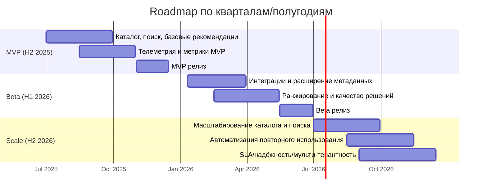

# Дорожная карта продукта

## Краткое текстовое резюме
В H2 2025 фокус на MVP: базовый каталог решений, поиск, рекомендации и минимальная телеметрия для проверки ценности. В H1 2026 выводим Beta с расширенными интеграциями, улучшенным ранжированием и управлением качеством. В H2 2026 масштабируем платформу: многотенантность, автоматизация повторного использования, SLA и производительность для роста объёма каталогов и пользователей.

## Визуальная дорожная карта

## Инициативы по кварталам/полугодиям (этапы, метрики)
| Период | Этап | Ключевые инициативы | Метрики успеха |
| --- | --- | --- | --- |
| Q3–Q4 2025 (H2) | MVP | Базовый каталог решений, поиск, первичные карточки решений, базовые рекомендации и телеметрия. | Time-to-Value ≤ 2 дня, активация ≥ 40%, CTR рекомендаций ≥ 10%, покрытие телеметрии ≥ 80%. |
| Q1–Q2 2026 (H1) | Beta | Интеграции с ключевыми источниками, расширение метаданных, улучшение ранжирования, цикл обратной связи. | Доля интегрированных источников ≥ 60%, точность рекомендаций (оценка пользователей) ≥ 4/5, повторное использование ≥ 25%. |
| Q3–Q4 2026 (H2) | Scale | Масштабирование поиска и каталога, автоматизация сборки сценариев, SLA и надёжность, мульти-тенантность. | Доступность ≥ 99.5%, среднее время ответа поиска ≤ 500 мс, рост активных пользователей ≥ 50% QoQ. |

## Зависимости и риски (критические внешние факторы)
| Блок | Зависимости | Критические внешние факторы | Риски |
| --- | --- | --- | --- |
| MVP | Доступ к базовым данным и разрешения на их использование. | Юридические согласования по данным, доступность источников. | Задержка доступа к данным → перенос MVP; неполные данные → снижение качества рекомендаций. |
| Beta | Стабильные API внешних систем, поддержка интеграций со стороны владельцев. | Изменения в API поставщиков, ограничения по rate limits. | Срыв интеграций → снижение ценности Beta, рост ручной поддержки. |
| Scale | Закупка инфраструктуры, поддержка безопасности и соответствия требованиям. | Политики безопасности/комплаенс, доступность облачных ресурсов. | Ограничение инфраструктуры → деградация SLA и задержка масштабирования. |

## Межэтапные зависимости
- Beta начинается после подтверждения метрик MVP (активация, CTR рекомендаций, покрытие телеметрии).
- Scale стартует после стабилизации интеграций и подтверждения качества рекомендаций в Beta.
