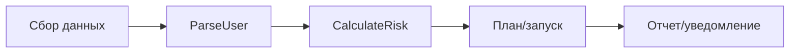
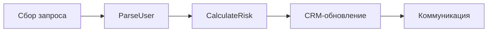
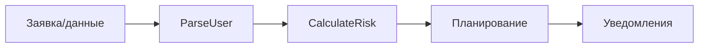
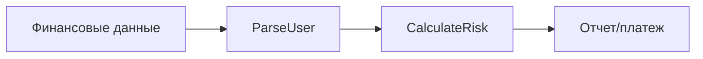
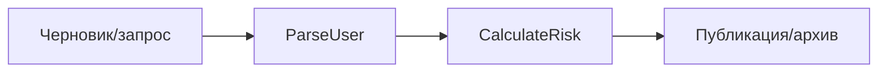
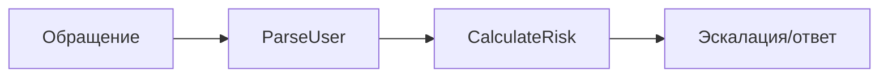
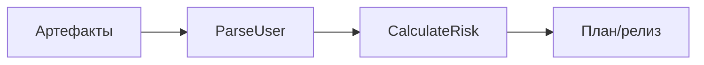
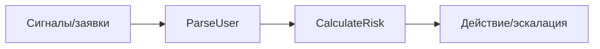

# Сценарные кластеры: цель, вертикали и карты

Приоритетная вертикаль зафиксирована в каноническом документе: [docs/vertical-selection.md](vertical-selection.md).

## Цель сценарных кластеров
Сценарные кластеры нужны для группировки типовых бизнес-задач по вертикалям, чтобы ускорить сбор требований, повторно использовать проверенные шаблоны и быстро сопоставлять шаги процесса с функциями платформы и приложениями из каталога. Это позволяет унифицировать язык между бизнесом и командой внедрения: сценарии становятся «сквозными» единицами, к которым легко привязать данные, автоматизации и метрики.

Внутри каждого кластера сценарии описываются как пайплайны (шаги → входы → выходы), а затем шаги сопоставляются с функциями из Function Dictionary и конкретными приложениями. Такой формат помогает выбирать оптимальный стек, выявлять пробелы в автоматизации и строить визуальные карты процессов.

## Function Dictionary (для сопоставления шагов)
| ID | Function | Назначение |
| --- | --- | --- |
| fn_parse_user | ParseUser | Нормализация/валидирование входных данных и контекста пользователя |
| fn_calculate_risk | CalculateRisk | Скоринг, приоритизация, контроль рисков/решений |

---

## Вертикаль 1: Маркетинг

### 1.1 Планирование кампании
| Шаг | Входы | Выходы | Функция | Приложения |
| --- | --- | --- | --- | --- |
| Сбор брифа | Бриф, цели, бюджет | Стандартизированный бриф | ParseUser | Notion, Confluence |
| Оценка рисков/приоритетов | Бриф, исторические данные | Приоритет кампании | CalculateRisk | Google Analytics |
| План работ | Приоритет, ресурсы | План кампании | ParseUser | Asana, Trello |
| Согласование | План кампании | Утверждение/правки | CalculateRisk | Slack, Microsoft Teams |

### 1.2 Сегментация лидов
| Шаг | Входы | Выходы | Функция | Приложения |
| --- | --- | --- | --- | --- |
| Сбор данных лидов | CRM, формы, веб-аналитика | Единый список лидов | ParseUser | HubSpot, Salesforce |
| Скоринг сегментов | Профили лидов | Сегменты с приоритетом | CalculateRisk | Google Analytics |
| Запись сегментов | Сегменты | Сохраненные сегменты | ParseUser | HubSpot, Salesforce |

### 1.3 Запуск email-кампании
| Шаг | Входы | Выходы | Функция | Приложения |
| --- | --- | --- | --- | --- |
| Подготовка базы | Сегменты | Валидная база рассылки | ParseUser | HubSpot, Mailchimp |
| Проверка рисков | База, правила | Риск-оценка отправки | CalculateRisk | Mailchimp |
| Запуск рассылки | База, контент | Отправленная кампания | ParseUser | Mailchimp, Gmail |
| Мониторинг | Статусы отправки | Отчет по доставке | CalculateRisk | Google Analytics |

### 1.4 Отчет по эффективности
| Шаг | Входы | Выходы | Функция | Приложения |
| --- | --- | --- | --- | --- |
| Сбор метрик | Источники трафика, кампании | Нормализованные метрики | ParseUser | Google Analytics |
| Анализ эффективности | Метрики | Выводы по ROI | CalculateRisk | Google Analytics |
| Публикация отчета | Выводы | Отчет | ParseUser | Confluence, Google Drive |

### 1.5 Управление контент-календарем
| Шаг | Входы | Выходы | Функция | Приложения |
| --- | --- | --- | --- | --- |
| Сбор идей | Идеи контента | Каталог идей | ParseUser | Notion |
| Приоритизация | Идеи, ресурсы | Очередь контента | CalculateRisk | Notion |
| Планирование публикаций | Очередь | Контент-календарь | ParseUser | Google Calendar |

---

## Вертикаль 2: Продажи

### 2.1 Квалификация лида
| Шаг | Входы | Выходы | Функция | Приложения |
| --- | --- | --- | --- | --- |
| Сбор информации | Запросы, формы | Карточка лида | ParseUser | Salesforce, HubSpot |
| Скоринг лида | Карточка лида | Уровень приоритета | CalculateRisk | Salesforce, HubSpot |
| Назначение менеджера | Приоритет | Ответственный | ParseUser | Salesforce, Slack |

### 2.2 Подготовка коммерческого предложения
| Шаг | Входы | Выходы | Функция | Приложения |
| --- | --- | --- | --- | --- |
| Сбор требований | Запрос клиента | Стандартизированный запрос | ParseUser | Salesforce |
| Оценка рисков/условий | Запрос, прайс | Рекомендованные условия | CalculateRisk | Salesforce |
| Подготовка предложения | Условия | КП | ParseUser | Google Drive, Outlook |

### 2.3 Обновление сделки в CRM
| Шаг | Входы | Выходы | Функция | Приложения |
| --- | --- | --- | --- | --- |
| Сбор статуса | Отчет менеджера | Нормализованный статус | ParseUser | Salesforce, HubSpot |
| Проверка рисков | Статус, KPI | Сигнал о риске | CalculateRisk | Salesforce |
| Обновление записи | Статус | Обновленная сделка | ParseUser | Salesforce |

### 2.4 Прогноз продаж
| Шаг | Входы | Выходы | Функция | Приложения |
| --- | --- | --- | --- | --- |
| Сбор данных по сделкам | CRM | Нормализованные данные | ParseUser | Salesforce |
| Расчет прогноза | Данные по сделкам | Прогноз | CalculateRisk | Salesforce |
| Публикация прогноза | Прогноз | Отчет | ParseUser | Confluence, Google Drive |

### 2.5 Согласование скидки
| Шаг | Входы | Выходы | Функция | Приложения |
| --- | --- | --- | --- | --- |
| Подготовка запроса | Сумма, сделка | Запрос на скидку | ParseUser | Salesforce |
| Риск-оценка | Запрос | Решение по скидке | CalculateRisk | Salesforce |
| Уведомление | Решение | Статус согласования | ParseUser | Slack, Microsoft Teams |

---

## Вертикаль 3: HR

### 3.1 Онбординг сотрудника
| Шаг | Входы | Выходы | Функция | Приложения |
| --- | --- | --- | --- | --- |
| Сбор данных | Анкета, документы | Профиль сотрудника | ParseUser | Google Drive, Notion |
| Проверка рисков | Профиль | Статус допуска | CalculateRisk | Notion |
| План онбординга | Профиль | План задач | ParseUser | Asana, Trello |
| Уведомления | План | Уведомления | ParseUser | Slack, Microsoft Teams |

### 3.2 Закрытие вакансии
| Шаг | Входы | Выходы | Функция | Приложения |
| --- | --- | --- | --- | --- |
| Сбор откликов | Резюме, анкеты | База кандидатов | ParseUser | Google Drive |
| Оценка кандидатов | База кандидатов | Рейтинг | CalculateRisk | Notion |
| Коммуникация | Рейтинг | Приглашения | ParseUser | Gmail, Outlook |

### 3.3 Оценка эффективности
| Шаг | Входы | Выходы | Функция | Приложения |
| --- | --- | --- | --- | --- |
| Сбор результатов | KPI, отзывы | Нормализованные данные | ParseUser | Google Drive |
| Анализ рисков | Данные | Риск/рекомендации | CalculateRisk | Notion |
| Отчет | Рекомендации | Итоговый отчет | ParseUser | Confluence |

### 3.4 Запрос отпуска
| Шаг | Входы | Выходы | Функция | Приложения |
| --- | --- | --- | --- | --- |
| Создание заявки | Запрос сотрудника | Стандартизированная заявка | ParseUser | Google Drive |
| Проверка ограничений | Заявка, график | Решение | CalculateRisk | Google Calendar |
| Уведомление | Решение | Подтверждение | ParseUser | Slack, Microsoft Teams |

### 3.5 Обучение и сертификация
| Шаг | Входы | Выходы | Функция | Приложения |
| --- | --- | --- | --- | --- |
| Сбор запросов | Заявки | Каталог обучения | ParseUser | Notion |
| Приоритизация | Каталог | План обучения | CalculateRisk | Notion |
| Планирование | План обучения | Календарь занятий | ParseUser | Google Calendar |

---

## Вертикаль 4: Финансы

### 4.1 Выставление счета
| Шаг | Входы | Выходы | Функция | Приложения |
| --- | --- | --- | --- | --- |
| Сбор данных | Заказ, реквизиты | Стандартизированный счет | ParseUser | Salesforce, Google Drive |
| Проверка рисков | Счет | Риск-оценка | CalculateRisk | Stripe |
| Отправка | Счет | Отправленный счет | ParseUser | Gmail, Outlook |

### 4.2 Сверка платежей
| Шаг | Входы | Выходы | Функция | Приложения |
| --- | --- | --- | --- | --- |
| Сбор данных | Выписки, платежи | Нормализованный реестр | ParseUser | Stripe |
| Сопоставление | Реестр | Результат сверки | CalculateRisk | Stripe |
| Отчет | Результат | Отчет | ParseUser | Google Drive |

### 4.3 Бюджетирование
| Шаг | Входы | Выходы | Функция | Приложения |
| --- | --- | --- | --- | --- |
| Сбор потребностей | Запросы отделов | Нормализованные заявки | ParseUser | Google Drive |
| Оценка рисков | Заявки | Проект бюджета | CalculateRisk | Google Drive |
| Согласование | Проект бюджета | Утвержденный бюджет | ParseUser | Slack, Microsoft Teams |

### 4.4 Закрытие месяца
| Шаг | Входы | Выходы | Функция | Приложения |
| --- | --- | --- | --- | --- |
| Сбор данных | Транзакции | Нормализованные данные | ParseUser | Stripe |
| Проверка рисков | Данные | Исключения | CalculateRisk | Stripe |
| Финальный отчет | Исключения | Закрытый период | ParseUser | Confluence |

### 4.5 Контроль расходов
| Шаг | Входы | Выходы | Функция | Приложения |
| --- | --- | --- | --- | --- |
| Сбор заявок | Чеки, заявки | Нормализованные заявки | ParseUser | Google Drive |
| Оценка рисков | Заявки | Решение по возмещению | CalculateRisk | Stripe |
| Уведомление | Решение | Статус | ParseUser | Slack, Microsoft Teams |

---

## Вертикаль 5: Документооборот

### 5.1 Создание договора
| Шаг | Входы | Выходы | Функция | Приложения |
| --- | --- | --- | --- | --- |
| Сбор требований | ТЗ, условия | Шаблон договора | ParseUser | Confluence |
| Проверка рисков | Шаблон | Рекомендации | CalculateRisk | Confluence |
| Подготовка версии | Рекомендации | Черновик договора | ParseUser | Google Drive |

### 5.2 Согласование документа
| Шаг | Входы | Выходы | Функция | Приложения |
| --- | --- | --- | --- | --- |
| Сбор комментариев | Черновик | Консолидированные правки | ParseUser | Google Drive |
| Оценка рисков | Правки | Решение о согласовании | CalculateRisk | Google Drive |
| Уведомление | Решение | Статус | ParseUser | Slack, Microsoft Teams |

### 5.3 Подпись и хранение
| Шаг | Входы | Выходы | Функция | Приложения |
| --- | --- | --- | --- | --- |
| Подготовка финала | Согласованный документ | Финальная версия | ParseUser | Google Drive |
| Проверка рисков | Финальная версия | Разрешение на подписание | CalculateRisk | Google Drive |
| Архивирование | Подписанный документ | Архив | ParseUser | SharePoint |

### 5.4 Поиск и выдача документа
| Шаг | Входы | Выходы | Функция | Приложения |
| --- | --- | --- | --- | --- |
| Запрос | Критерии поиска | Нормализованный запрос | ParseUser | SharePoint |
| Оценка рисков | Запрос, права | Решение по доступу | CalculateRisk | SharePoint |
| Выдача | Решение | Ссылка на документ | ParseUser | SharePoint |

### 5.5 Версионирование
| Шаг | Входы | Выходы | Функция | Приложения |
| --- | --- | --- | --- | --- |
| Сбор изменений | Правки | Набор изменений | ParseUser | Google Drive |
| Оценка рисков | Изменения | Решение о версии | CalculateRisk | Google Drive |
| Публикация версии | Решение | Новая версия | ParseUser | SharePoint |

---

## Вертикаль 6: Поддержка клиентов

### 6.1 Регистрация обращения
| Шаг | Входы | Выходы | Функция | Приложения |
| --- | --- | --- | --- | --- |
| Сбор обращения | Заявка | Карточка тикета | ParseUser | Zendesk, Intercom |
| Приоритизация | Карточка тикета | Приоритет | CalculateRisk | Zendesk |
| Уведомление | Приоритет | Назначение | ParseUser | Slack |

### 6.2 Эскалация инцидента
| Шаг | Входы | Выходы | Функция | Приложения |
| --- | --- | --- | --- | --- |
| Сбор данных | Тикет | Консолидированный инцидент | ParseUser | Zendesk |
| Оценка рисков | Инцидент | Уровень эскалации | CalculateRisk | Jira |
| Эскалация | Уровень | Эскалированный кейс | ParseUser | Jira, Slack |

### 6.3 Обновление базы знаний
| Шаг | Входы | Выходы | Функция | Приложения |
| --- | --- | --- | --- | --- |
| Сбор статей | Черновики | Нормализованные статьи | ParseUser | Confluence, Notion |
| Проверка качества | Статьи | Решение о публикации | CalculateRisk | Confluence |
| Публикация | Решение | Обновленная база знаний | ParseUser | Confluence |

### 6.4 Сбор обратной связи (CSAT)
| Шаг | Входы | Выходы | Функция | Приложения |
| --- | --- | --- | --- | --- |
| Сбор ответов | Опросы | Нормализованные ответы | ParseUser | Gmail |
| Анализ рисков | Ответы | Риск-оценка | CalculateRisk | Google Analytics |
| Отчет | Риск-оценка | Отчет CSAT | ParseUser | Google Drive |

### 6.5 Аналитика обращений
| Шаг | Входы | Выходы | Функция | Приложения |
| --- | --- | --- | --- | --- |
| Сбор данных | Тикеты | Нормализованные данные | ParseUser | Zendesk |
| Анализ трендов | Данные | Риски/тренды | CalculateRisk | Google Analytics |
| Публикация | Тренды | Дашборд | ParseUser | Confluence |

---

## Вертикаль 7: Продукт и проектное управление

### 7.1 Планирование спринта
| Шаг | Входы | Выходы | Функция | Приложения |
| --- | --- | --- | --- | --- |
| Сбор требований | Бэклог | Нормализованный бэклог | ParseUser | Jira |
| Приоритизация | Бэклог | План спринта | CalculateRisk | Jira |
| Планирование | План спринта | Спринт-борд | ParseUser | Jira |

### 7.2 Приемка фичи
| Шаг | Входы | Выходы | Функция | Приложения |
| --- | --- | --- | --- | --- |
| Сбор результатов | Тесты, PR | Нормализованные результаты | ParseUser | GitHub |
| Риск-оценка | Результаты | Решение о приемке | CalculateRisk | GitHub |
| Уведомление | Решение | Статус приемки | ParseUser | Slack |

### 7.3 Дизайн-ревью
| Шаг | Входы | Выходы | Функция | Приложения |
| --- | --- | --- | --- | --- |
| Сбор макетов | Макеты | Нормализованные макеты | ParseUser | Figma |
| Оценка рисков | Макеты | Рекомендации | CalculateRisk | Figma |
| Согласование | Рекомендации | Решение | ParseUser | Miro |

### 7.4 Релиз-ноты
| Шаг | Входы | Выходы | Функция | Приложения |
| --- | --- | --- | --- | --- |
| Сбор изменений | Коммиты, задачи | Нормализованный список | ParseUser | GitHub, Jira |
| Приоритизация | Список | Ключевые изменения | CalculateRisk | Jira |
| Публикация | Ключевые изменения | Релиз-ноты | ParseUser | Confluence |

### 7.5 Ретроспектива
| Шаг | Входы | Выходы | Функция | Приложения |
| --- | --- | --- | --- | --- |
| Сбор обратной связи | Комментарии | Нормализованные инсайты | ParseUser | Miro |
| Оценка рисков | Инсайты | Критичность проблем | CalculateRisk | Miro |
| План улучшений | Критичность | План действий | ParseUser | Jira |

---

## Вертикаль 8: IT и Operations

### 8.1 Запрос доступа
| Шаг | Входы | Выходы | Функция | Приложения |
| --- | --- | --- | --- | --- |
| Сбор заявки | Запрос пользователя | Стандартизированная заявка | ParseUser | Jira |
| Проверка рисков | Заявка | Решение | CalculateRisk | Jira |
| Уведомление | Решение | Статус | ParseUser | Slack |

### 8.2 Мониторинг инцидента
| Шаг | Входы | Выходы | Функция | Приложения |
| --- | --- | --- | --- | --- |
| Сбор сигналов | Метрики | Нормализованные сигналы | ParseUser | Kubernetes |
| Оценка рисков | Сигналы | Уровень инцидента | CalculateRisk | Kubernetes |
| Эскалация | Уровень | Инцидент | ParseUser | Jira |

### 8.3 Обновление инфраструктуры
| Шаг | Входы | Выходы | Функция | Приложения |
| --- | --- | --- | --- | --- |
| Сбор изменений | План обновления | Нормализованный план | ParseUser | GitLab |
| Проверка рисков | План | Решение о деплое | CalculateRisk | GitLab |
| Выполнение | Решение | Отчет об обновлении | ParseUser | Kubernetes |

### 8.4 Управление активами
| Шаг | Входы | Выходы | Функция | Приложения |
| --- | --- | --- | --- | --- |
| Сбор данных | Инвентаризация | Нормализованные активы | ParseUser | Google Drive |
| Оценка рисков | Активы | Риски по активам | CalculateRisk | Google Drive |
| Отчет | Риски | Отчет | ParseUser | Confluence |

### 8.5 Смена паролей/секретов
| Шаг | Входы | Выходы | Функция | Приложения |
| --- | --- | --- | --- | --- |
| Сбор запроса | Запрос | Нормализованный запрос | ParseUser | Jira |
| Проверка рисков | Запрос | Разрешение | CalculateRisk | Jira |
| Уведомление | Разрешение | Статус смены | ParseUser | Slack |

---

## Таблица «Сценарий → Шаги → Функции → Приложения»
| Сценарий | Шаги | Функции | Приложения |
| --- | --- | --- | --- |
| Маркетинг: Планирование кампании | Сбор брифа → Оценка рисков → План работ → Согласование | ParseUser, CalculateRisk | Notion, Confluence, Google Analytics, Asana, Trello, Slack, Microsoft Teams |
| Маркетинг: Сегментация лидов | Сбор данных → Скоринг сегментов → Запись сегментов | ParseUser, CalculateRisk | HubSpot, Salesforce, Google Analytics |
| Маркетинг: Запуск email-кампании | Подготовка базы → Проверка рисков → Запуск рассылки → Мониторинг | ParseUser, CalculateRisk | HubSpot, Mailchimp, Gmail, Google Analytics |
| Маркетинг: Отчет по эффективности | Сбор метрик → Анализ эффективности → Публикация отчета | ParseUser, CalculateRisk | Google Analytics, Confluence, Google Drive |
| Маркетинг: Контент-календарь | Сбор идей → Приоритизация → Планирование публикаций | ParseUser, CalculateRisk | Notion, Google Calendar |
| Продажи: Квалификация лида | Сбор информации → Скоринг лида → Назначение менеджера | ParseUser, CalculateRisk | Salesforce, HubSpot, Slack |
| Продажи: Коммерческое предложение | Сбор требований → Оценка рисков → Подготовка предложения | ParseUser, CalculateRisk | Salesforce, Google Drive, Outlook |
| Продажи: Обновление сделки | Сбор статуса → Проверка рисков → Обновление записи | ParseUser, CalculateRisk | Salesforce, HubSpot |
| Продажи: Прогноз продаж | Сбор данных → Расчет прогноза → Публикация | ParseUser, CalculateRisk | Salesforce, Confluence, Google Drive |
| Продажи: Согласование скидки | Подготовка запроса → Риск-оценка → Уведомление | ParseUser, CalculateRisk | Salesforce, Slack, Microsoft Teams |
| HR: Онбординг | Сбор данных → Проверка рисков → План онбординга → Уведомления | ParseUser, CalculateRisk | Google Drive, Notion, Asana, Trello, Slack, Microsoft Teams |
| HR: Закрытие вакансии | Сбор откликов → Оценка кандидатов → Коммуникация | ParseUser, CalculateRisk | Google Drive, Notion, Gmail, Outlook |
| HR: Оценка эффективности | Сбор результатов → Анализ рисков → Отчет | ParseUser, CalculateRisk | Google Drive, Notion, Confluence |
| HR: Запрос отпуска | Создание заявки → Проверка ограничений → Уведомление | ParseUser, CalculateRisk | Google Drive, Google Calendar, Slack, Microsoft Teams |
| HR: Обучение и сертификация | Сбор запросов → Приоритизация → Планирование | ParseUser, CalculateRisk | Notion, Google Calendar |
| Финансы: Выставление счета | Сбор данных → Проверка рисков → Отправка | ParseUser, CalculateRisk | Salesforce, Google Drive, Stripe, Gmail, Outlook |
| Финансы: Сверка платежей | Сбор данных → Сопоставление → Отчет | ParseUser, CalculateRisk | Stripe, Google Drive |
| Финансы: Бюджетирование | Сбор потребностей → Оценка рисков → Согласование | ParseUser, CalculateRisk | Google Drive, Slack, Microsoft Teams |
| Финансы: Закрытие месяца | Сбор данных → Проверка рисков → Финальный отчет | ParseUser, CalculateRisk | Stripe, Confluence |
| Финансы: Контроль расходов | Сбор заявок → Оценка рисков → Уведомление | ParseUser, CalculateRisk | Google Drive, Stripe, Slack, Microsoft Teams |
| Документооборот: Создание договора | Сбор требований → Проверка рисков → Подготовка версии | ParseUser, CalculateRisk | Confluence, Google Drive |
| Документооборот: Согласование документа | Сбор комментариев → Оценка рисков → Уведомление | ParseUser, CalculateRisk | Google Drive, Slack, Microsoft Teams |
| Документооборот: Подпись и хранение | Подготовка финала → Проверка рисков → Архивирование | ParseUser, CalculateRisk | Google Drive, SharePoint |
| Документооборот: Поиск и выдача | Запрос → Оценка рисков → Выдача | ParseUser, CalculateRisk | SharePoint |
| Документооборот: Версионирование | Сбор изменений → Оценка рисков → Публикация версии | ParseUser, CalculateRisk | Google Drive, SharePoint |
| Поддержка: Регистрация обращения | Сбор обращения → Приоритизация → Уведомление | ParseUser, CalculateRisk | Zendesk, Intercom, Slack |
| Поддержка: Эскалация инцидента | Сбор данных → Оценка рисков → Эскалация | ParseUser, CalculateRisk | Zendesk, Jira, Slack |
| Поддержка: Обновление базы знаний | Сбор статей → Проверка качества → Публикация | ParseUser, CalculateRisk | Confluence, Notion |
| Поддержка: CSAT | Сбор ответов → Анализ рисков → Отчет | ParseUser, CalculateRisk | Gmail, Google Analytics, Google Drive |
| Поддержка: Аналитика обращений | Сбор данных → Анализ трендов → Публикация | ParseUser, CalculateRisk | Zendesk, Google Analytics, Confluence |
| Продукт: Планирование спринта | Сбор требований → Приоритизация → Планирование | ParseUser, CalculateRisk | Jira |
| Продукт: Приемка фичи | Сбор результатов → Риск-оценка → Уведомление | ParseUser, CalculateRisk | GitHub, Slack |
| Продукт: Дизайн-ревью | Сбор макетов → Оценка рисков → Согласование | ParseUser, CalculateRisk | Figma, Miro |
| Продукт: Релиз-ноты | Сбор изменений → Приоритизация → Публикация | ParseUser, CalculateRisk | GitHub, Jira, Confluence |
| Продукт: Ретроспектива | Сбор обратной связи → Оценка рисков → План улучшений | ParseUser, CalculateRisk | Miro, Jira |
| IT/Ops: Запрос доступа | Сбор заявки → Проверка рисков → Уведомление | ParseUser, CalculateRisk | Jira, Slack |
| IT/Ops: Мониторинг инцидента | Сбор сигналов → Оценка рисков → Эскалация | ParseUser, CalculateRisk | Kubernetes, Jira |
| IT/Ops: Обновление инфраструктуры | Сбор изменений → Проверка рисков → Выполнение | ParseUser, CalculateRisk | GitLab, Kubernetes |
| IT/Ops: Управление активами | Сбор данных → Оценка рисков → Отчет | ParseUser, CalculateRisk | Google Drive, Confluence |
| IT/Ops: Смена паролей/секретов | Сбор запроса → Проверка рисков → Уведомление | ParseUser, CalculateRisk | Jira, Slack |

---

## Визуальные карты сценариев (схемы)

### Маркетинг

### Продажи

### HR

### Финансы

### Документооборот

### Поддержка

### Продукт

### IT/Ops

