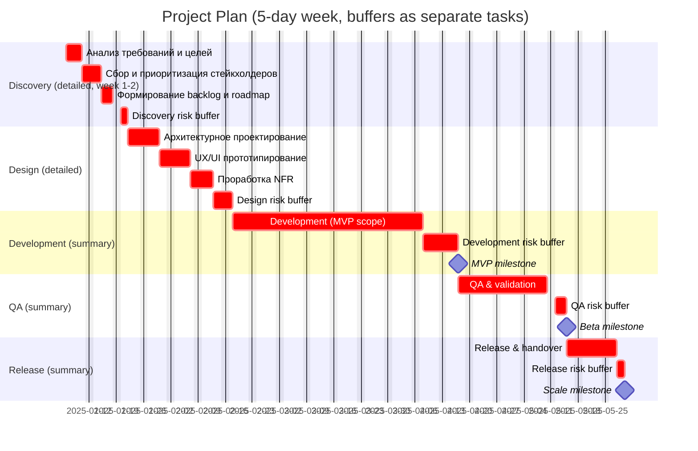

# Project Timeline

> Fill in the duration estimates (in working days), risk criticality, and baseline start date.
> The schedule fields will then be calculated accordingly.

## Assumptions
- Working calendar: 5-day work week.
- Buffers are added to each stage as a separate line item (not merged into the base estimate).
- Dates should be adjusted after approvals/inputs are available.

## Stage Plan

| Stage | Base estimate (days) | Risk criticality (Low/Med/High) | Risk buffer (days) | Dependencies | Critical path | Start date | End date | Notes |
| --- | --- | --- | --- | --- | --- | --- | --- | --- |
| 1. Discovery & scope | 10 | Med | 2 | None | Yes | 2025-01-06 | 2025-01-21 | Detailed tasks in Gantt |
| 2. Requirements & solution design | 16 | Med | 3 | 1 | Yes | 2025-01-22 | 2025-02-17 | Detailed tasks in Gantt |
| 3. Implementation | 35 | High | 7 | 2 | Yes | 2025-02-18 | 2025-04-16 | MVP milestone at end of stage |
| 4. QA & validation | 17 | Med | 3 | 3 | Yes | 2025-04-17 | 2025-05-14 | Beta milestone at end of stage |
| 5. Release & handover | 9 | Low | 2 | 4 | Yes | 2025-05-15 | 2025-05-29 | Scale milestone at end of stage |

## Critical Path Summary
- 1 → 2 → 3 → 4 → 5 (sequential dependency chain; buffers add calendar time but not scope).

## Overall Duration
- Total base duration: 87 days
- Total buffer: 17 days
- Total duration (base + buffer): 104 days

## Date Baseline
- Project start: 2025-01-06
- Project end: 2025-05-29

## Gantt (Discovery/Design detailed, rest summarized)

